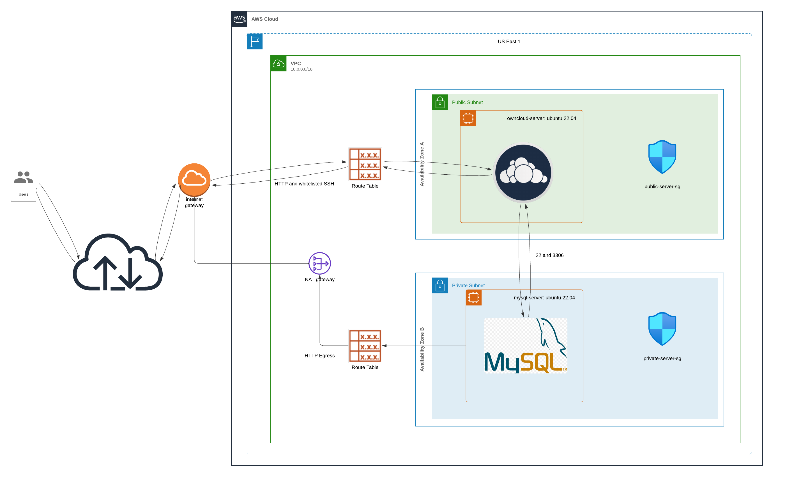
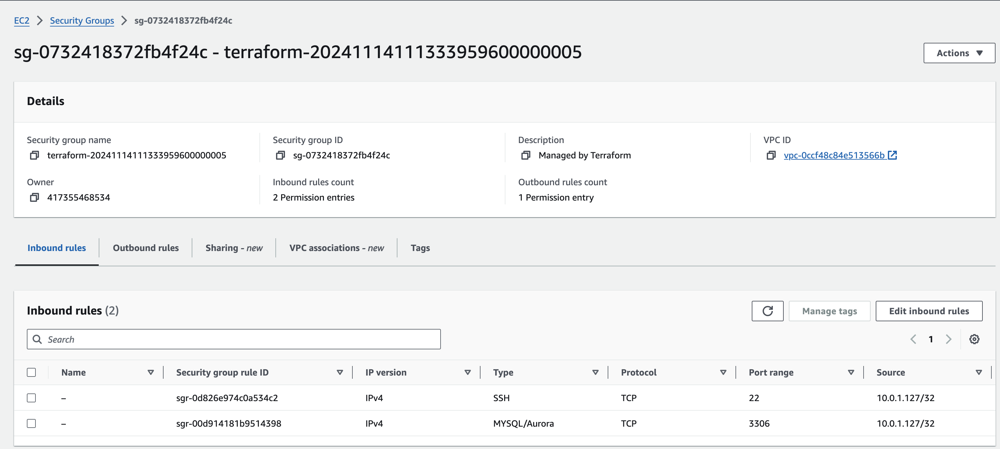
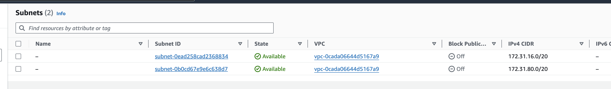

# Owncloud Solution

Implement an Owncloud file server so that our organization can store and share files in a secure manner; 
giving our organization the ability to enforce our security policy. Implementation will involve creating
the following AWS resources.

1.	A vpc.
2.	A public subnet.
3.	A private subnet.
4.	A public security group (details below)
5.	A private security group (details below)
6.	An internet gateway.
7.	A NAT gateway.
8.	A public ec2 instance.
9.	A private ec2 instance.

## Architectural Diagram



## VPC

### Requirements:

Custom VPC called "owncloud-vpc".

> 

```terraform
resource "aws_vpc" "owncloud-vpc" {
  cidr_block       = var.vpc_cidr_block
  instance_tenancy = "default"

  tags = merge(
    local.common_tags,
    {
      Name = var.vpc_name
    }
  )
}
```

## Public Subnet

### Requirements:

One of two subnets (this one public the other private)

> 

```terraform
resource "aws_subnet" "public_subnet" {
  vpc_id                  = aws_vpc.owncloud-vpc.id
  cidr_block              = var.public_subnet_cidr_block
  availability_zone       = "us-east-1a"
  map_public_ip_on_launch = true

  tags = merge(
    local.common_tags,
    {
      Name = "public_subnet"
    }
  )
}
```
## Public Security Group

### Requirements:

Allows public http access ("0.0.0.0/0"") to the ownCloud server over port 80.  
Allows ssh over port 22 from whitelisted IPs.

> 

```terraform
resource "aws_security_group" "public_sg" {
  vpc_id = aws_vpc.owncloud-vpc.id

  description = "Opens port for SSH and HTTP"

  ingress {
    from_port   = 80
    to_port     = 80
    protocol    = "tcp"
    cidr_blocks = ["0.0.0.0/0"]
  }

  ingress {
    from_port   = 22
    to_port     = 22
    protocol    = "tcp"
    cidr_blocks = [var.ssh_allowed_ip]
  }

  egress {
    from_port   = 0
    to_port     = 0
    protocol    = "-1"
    cidr_blocks = ["0.0.0.0/0"]
  }

  tags = merge(
    local.common_tags,
    {
      Name = "public-server-SG"
    }
  )
}
```

## Private Subnet

### Requirements:

One of two subnets (this one private the other public)

> 

```terraform
resource "aws_subnet" "private_subnet" {
  vpc_id            = aws_vpc.owncloud-vpc.id
  cidr_block        = var.private_subnet_cidr_block
  availability_zone = "us-east-1b"

  tags = merge(
    local.common_tags,
    {
      Name = "private_subnet"
    }
  )
}
```
## Private Security Group

### Requirements:

Allows ingress on port 3306 and 22 from the public ec2 instance private IP.
The public ec2 is a "Bastion Box".
There is no ingress on port 80.

> 

```terraform
resource "aws_security_group" "private_sg" {
  vpc_id = aws_vpc.owncloud-vpc.id

  # mysql
  ingress {
    from_port = 3306
    to_port   = 3306
    protocol  = "tcp"
    cidr_blocks = ["${aws_instance.owncloud-server.private_ip}/32"]
  }

  # bastion setup
  ingress {
    from_port   = 22
    to_port     = 22
    protocol    = "tcp"
    cidr_blocks = ["${aws_instance.owncloud-server.private_ip}/32"]
  }

  egress {
    from_port   = 0
    to_port     = 0
    protocol    = "-1"
    cidr_blocks = ["0.0.0.0/0"]
  }

  tags = merge(
    local.common_tags,
    {
      Name = "private-server-SG"
    }
  )
}
```

## Internet Gateway

### Requirements:
> 
### Requirements:

## NAT Gateway
> 
## Public ec2 Instance

### Requirements:

Deploy an ec2 instance in the public subnet for the OwnCloud installation.

> 

```terraform
resource "aws_instance" "owncloud-server" {
  ami                         = var.ubuntu_ami
  instance_type               = "t2.micro"
  subnet_id                   = aws_subnet.public_subnet.id
  associate_public_ip_address = true
  key_name                    = var.key_pair

  vpc_security_group_ids = [aws_security_group.public_sg.id]

  tags = merge(
    local.common_tags,
    {
      Name = "owncloud-server"
    }
  )
}

variable "ubuntu_ami" {
  description = "AMIs for Ubuntu 22.04 instances"
  type        = string
  default     = "ami-005fc0f236362e99f"
}
```

## Private ec2 Instance

### Requirements:

Deploy an ec2 instance in the private subnet to host the MySQL database for the OwnCloud server.

> 

```terraform
resource "aws_instance" "mysql-server" {
  ami           = var.private_server_ami
  instance_type = "t2.micro"
  subnet_id     = aws_subnet.private_subnet.id
  key_name      = var.key_pair

  vpc_security_group_ids = [aws_security_group.private_sg.id]

  tags = merge(
    local.common_tags,
    {
      Name = "mysql-server"
    }
  )
}

variable "private_server_ami" {
  description = "Private server ami with mysql installed on it"
  type        = string
}
```

Installing MySQL was tedious.  So I created an ami from the server after I was satisfied.  
This proved to be useful since I could destroy and apply the ec2 resource daily.  The ami id was stored 
in a terraform.tfvars file: `private_server_ami = "ami-07a20a9cd4c1fcfaa"`.

> 

## Notes

### OwnCloud deployment

We were successful in standing up the OwnCloud app.  And we were able to configure it minimally.


### _However without https service, the browser and local gateway blocks posting with an anti-phishing policy._


## Tear Down

```bash
❯ terraform show -json | jq -r '.values.root_module.resources[] | [.type, .name] | @tsv' | column -t

aws_eip                      nat_eip
aws_instance                 mysql-server
aws_instance                 owncloud-server
aws_internet_gateway         igw
aws_nat_gateway              nat_gateway
aws_route_table              private_route_table
aws_route_table              public_route_table
aws_route_table_association  private_route_table_association
aws_route_table_association  public_rt_association
aws_security_group           private_sg
aws_security_group           public_sg
aws_subnet                   private_subnet
aws_subnet                   public_subnet
aws_vpc                      owncloud-vpc

❯ terraform destroy
aws_vpc.owncloud-vpc: Refreshing state... [id=vpc-0ccf48c84e513566b]
aws_eip.nat_eip: Refreshing state... [id=eipalloc-07c6444a1902e5483]
aws_internet_gateway.igw: Refreshing state... [id=igw-052a178f191398664]
aws_subnet.private_subnet: Refreshing state... [id=subnet-062f296ed8c1ed690]
aws_subnet.public_subnet: Refreshing state... [id=subnet-0130915a13851af50]
aws_security_group.public_sg: Refreshing state... [id=sg-0f0270731dada77cb]
aws_route_table.public_route_table: Refreshing state... [id=rtb-00e7053fee9deb710]
aws_nat_gateway.nat_gateway: Refreshing state... [id=nat-04dd7e7de78c0be76]
aws_route_table_association.public_rt_association: Refreshing state... [id=rtbassoc-02aa6617f3a642633]
aws_instance.owncloud-server: Refreshing state... [id=i-097d9d0d54bcc1ebb]
aws_route_table.private_route_table: Refreshing state... [id=rtb-015b81355ca3a49fe]
aws_route_table_association.private_route_table_association: Refreshing state... [id=rtbassoc-00982c2221759936c]
aws_security_group.private_sg: Refreshing state... [id=sg-0732418372fb4f24c]
aws_instance.mysql-server: Refreshing state... [id=i-03452a83c5de4229c]

Plan: 0 to add, 0 to change, 14 to destroy.

Changes to Outputs:
  - internet_gateway_id            = "igw-052a178f191398664" -> null
  - mysql_server_ssh_string        = "ssh -i own-cloud.pem ubuntu@10.0.2.24" -> null
  - nat_gateway_id                 = "nat-04dd7e7de78c0be76" -> null
  - owncloud_ssh_string            = "ssh -i own-cloud.pem ubuntu@100.26.43.28" -> null
  - private_route_table_id         = "rtb-015b81355ca3a49fe" -> null
  - private_server_ec2             = "i-03452a83c5de4229c" -> null
  - private_server_sg_id           = "sg-0732418372fb4f24c" -> null
  - private_subnet_cidr_block      = "10.0.2.0/24" -> null
  - private_subnet_id              = "subnet-062f296ed8c1ed690" -> null
  - public_route_table_id          = "rtb-00e7053fee9deb710" -> null
  - public_server_ec2              = "i-097d9d0d54bcc1ebb" -> null
  - public_server_sg_id            = "sg-0f0270731dada77cb" -> null
  - public_subnet_cidr_block       = "10.0.1.0/24" -> null
  - public_subnet_id               = "subnet-0130915a13851af50" -> null
  - scp_command_to_owncloud_server = "scp -i own-cloud.pem ./own-cloud.pem ubuntu@100.26.43.28:/home/ubuntu/own-cloud.pem" -> null
  - vpc_id                         = "vpc-0ccf48c84e513566b" -> null

Do you really want to destroy all resources?
  Terraform will destroy all your managed infrastructure, as shown above.
  There is no undo. Only 'yes' will be accepted to confirm.

  Enter a value: yes

aws_route_table_association.public_rt_association: Destroying... [id=rtbassoc-02aa6617f3a642633]
aws_route_table_association.private_route_table_association: Destroying... [id=rtbassoc-00982c2221759936c]
aws_instance.mysql-server: Destroying... [id=i-03452a83c5de4229c]
aws_route_table_association.private_route_table_association: Still destroying... [id=rtbassoc-00982c2221759936c, 10s elapsed]
aws_route_table_association.public_rt_association: Still destroying... [id=rtbassoc-02aa6617f3a642633, 10s elapsed]
aws_instance.mysql-server: Still destroying... [id=i-03452a83c5de4229c, 10s elapsed]
aws_route_table_association.public_rt_association: Destruction complete after 13s
aws_route_table_association.private_route_table_association: Destruction complete after 13s
aws_route_table.public_route_table: Destroying... [id=rtb-00e7053fee9deb710]
aws_route_table.private_route_table: Destroying... [id=rtb-015b81355ca3a49fe]
aws_route_table.private_route_table: Destruction complete after 1s
aws_nat_gateway.nat_gateway: Destroying... [id=nat-04dd7e7de78c0be76]
aws_route_table.public_route_table: Destruction complete after 1s
aws_internet_gateway.igw: Destroying... [id=igw-052a178f191398664]
aws_instance.mysql-server: Still destroying... [id=i-03452a83c5de4229c, 20s elapsed]
aws_nat_gateway.nat_gateway: Still destroying... [id=nat-04dd7e7de78c0be76, 10s elapsed]
aws_internet_gateway.igw: Still destroying... [id=igw-052a178f191398664, 10s elapsed]
aws_instance.mysql-server: Still destroying... [id=i-03452a83c5de4229c, 30s elapsed]
aws_nat_gateway.nat_gateway: Still destroying... [id=nat-04dd7e7de78c0be76, 20s elapsed]
aws_internet_gateway.igw: Still destroying... [id=igw-052a178f191398664, 20s elapsed]
aws_instance.mysql-server: Still destroying... [id=i-03452a83c5de4229c, 40s elapsed]
aws_nat_gateway.nat_gateway: Still destroying... [id=nat-04dd7e7de78c0be76, 30s elapsed]
aws_internet_gateway.igw: Still destroying... [id=igw-052a178f191398664, 30s elapsed]
aws_instance.mysql-server: Still destroying... [id=i-03452a83c5de4229c, 50s elapsed]
aws_nat_gateway.nat_gateway: Still destroying... [id=nat-04dd7e7de78c0be76, 40s elapsed]
aws_internet_gateway.igw: Still destroying... [id=igw-052a178f191398664, 40s elapsed]
aws_nat_gateway.nat_gateway: Destruction complete after 41s
aws_eip.nat_eip: Destroying... [id=eipalloc-07c6444a1902e5483]
aws_eip.nat_eip: Destruction complete after 1s
aws_instance.mysql-server: Still destroying... [id=i-03452a83c5de4229c, 1m0s elapsed]
aws_internet_gateway.igw: Still destroying... [id=igw-052a178f191398664, 50s elapsed]
aws_instance.mysql-server: Still destroying... [id=i-03452a83c5de4229c, 1m10s elapsed]
aws_instance.mysql-server: Destruction complete after 1m11s
aws_subnet.private_subnet: Destroying... [id=subnet-062f296ed8c1ed690]
aws_security_group.private_sg: Destroying... [id=sg-0732418372fb4f24c]
aws_subnet.private_subnet: Destruction complete after 0s
aws_security_group.private_sg: Destruction complete after 0s
aws_instance.owncloud-server: Destroying... [id=i-097d9d0d54bcc1ebb]
aws_internet_gateway.igw: Still destroying... [id=igw-052a178f191398664, 1m0s elapsed]
aws_instance.owncloud-server: Still destroying... [id=i-097d9d0d54bcc1ebb, 10s elapsed]
aws_internet_gateway.igw: Still destroying... [id=igw-052a178f191398664, 1m10s elapsed]
aws_instance.owncloud-server: Still destroying... [id=i-097d9d0d54bcc1ebb, 20s elapsed]
aws_internet_gateway.igw: Still destroying... [id=igw-052a178f191398664, 1m20s elapsed]
aws_instance.owncloud-server: Still destroying... [id=i-097d9d0d54bcc1ebb, 30s elapsed]
aws_internet_gateway.igw: Still destroying... [id=igw-052a178f191398664, 1m30s elapsed]
aws_instance.owncloud-server: Still destroying... [id=i-097d9d0d54bcc1ebb, 40s elapsed]
aws_internet_gateway.igw: Still destroying... [id=igw-052a178f191398664, 1m40s elapsed]
aws_instance.owncloud-server: Still destroying... [id=i-097d9d0d54bcc1ebb, 50s elapsed]
aws_internet_gateway.igw: Still destroying... [id=igw-052a178f191398664, 1m50s elapsed]
aws_instance.owncloud-server: Still destroying... [id=i-097d9d0d54bcc1ebb, 1m0s elapsed]
aws_internet_gateway.igw: Still destroying... [id=igw-052a178f191398664, 2m0s elapsed]
aws_instance.owncloud-server: Still destroying... [id=i-097d9d0d54bcc1ebb, 1m10s elapsed]
aws_internet_gateway.igw: Still destroying... [id=igw-052a178f191398664, 2m10s elapsed]
aws_instance.owncloud-server: Still destroying... [id=i-097d9d0d54bcc1ebb, 1m20s elapsed]
aws_internet_gateway.igw: Destruction complete after 2m19s
aws_instance.owncloud-server: Still destroying... [id=i-097d9d0d54bcc1ebb, 1m30s elapsed]
aws_instance.owncloud-server: Destruction complete after 1m32s
aws_subnet.public_subnet: Destroying... [id=subnet-0130915a13851af50]
aws_security_group.public_sg: Destroying... [id=sg-0f0270731dada77cb]
aws_subnet.public_subnet: Destruction complete after 0s
aws_security_group.public_sg: Destruction complete after 1s
aws_vpc.owncloud-vpc: Destroying... [id=vpc-0ccf48c84e513566b]
aws_vpc.owncloud-vpc: Destruction complete after 0s

Destroy complete! Resources: 14 destroyed.
```

### VPC

#### Before


#### After


### Subnets

#### Before


#### After


### Security Groups

#### Before


#### After


### IGW

#### Before


#### After


### EIP

#### Before


#### After


### Nat Gateway

#### Before


#### After


Notice the state is now "deleted."

### Route Tables

#### Before


#### After


### EC2 Instances

## Before


## After


